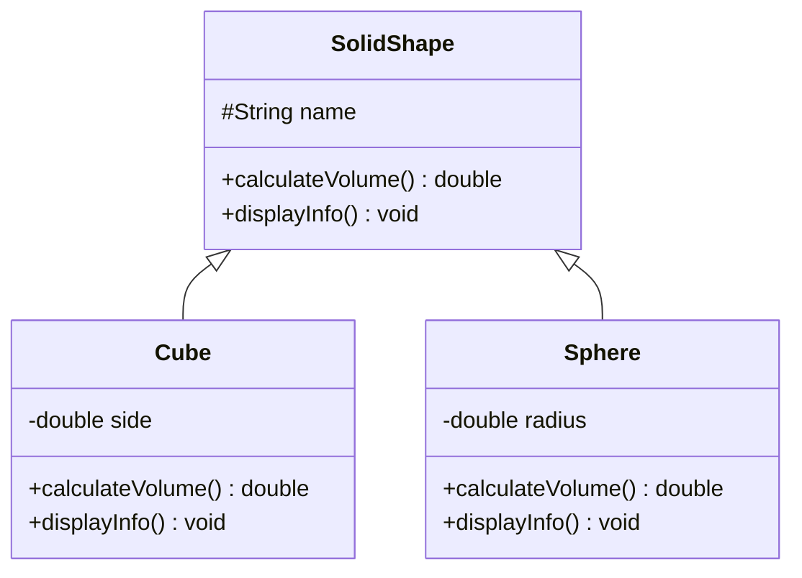

```mermaid
classDiagram
    class SolidShape {
        #String name
        +calculateVolume() double
        +displayInfo() void
    }
    class Cube {
        -double side
        +calculateVolume() double
        +displayInfo() void
    }
    class Sphere {
        -double radius
        +calculateVolume() double
        +displayInfo() void
    }
    SolidShape <|-- Cube
    SolidShape <|-- Sphere
```